  <picture>
    <source media="(prefers-color-scheme: dark)" srcset="assets/hero-dark.svg">
    
  </picture>

<samp>

**B.Tech Cybersecurity · ASE '27 · Tamil Nadu, India**

Offensive security → AI red teaming. I break things politely — networks, web apps, and now language models.

- 🎯 currently: AI security research · building offensive tooling
- 🌐 [praneeshrv.me](https://www.praneeshrv.me) · [LinkedIn](https://www.linkedin.com/in/praneesh-r-v-3a81b221a/) · [LeetCode](https://www.leetcode.com/praneeshrv404)
- 🐧 I use Arch btw

</samp>

## <samp>⚡ stack</samp>

## <samp>📊 telemetry</samp>

<picture>
  <source media="(prefers-color-scheme: dark)" srcset="https://github-readme-stats-nine-amber-49.vercel.app/api?username=PraneeshRV&show_icons=true&hide_border=true&count_private=true&disable_animations=true&bg_color=00000000&title_color=ff2fd6&icon_color=00e5ff&text_color=9aa4c2&ring_color=ff2fd6">
  
</picture><picture>
  <source media="(prefers-color-scheme: dark)" srcset="https://github-readme-stats-nine-amber-49.vercel.app/api/top-langs/?username=PraneeshRV&layout=compact&hide_border=true&disable_animations=true&bg_color=00000000&title_color=ff2fd6&text_color=9aa4c2">
  
</picture>

<picture>
  <source media="(prefers-color-scheme: dark)" srcset="https://raw.githubusercontent.com/PraneeshRV/PraneeshRV/output/streak-dark.svg">
  
</picture>

## <samp>📟 contribution radar</samp>

<picture>
  <source media="(prefers-color-scheme: dark)" srcset="https://raw.githubusercontent.com/PraneeshRV/PraneeshRV/output/radar-dark.svg">
  
</picture>
