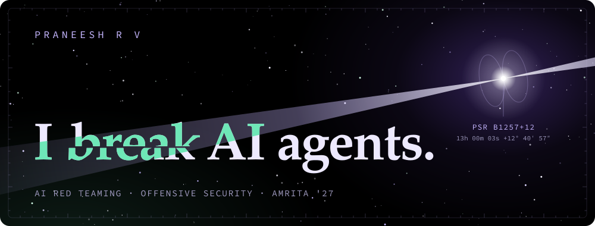
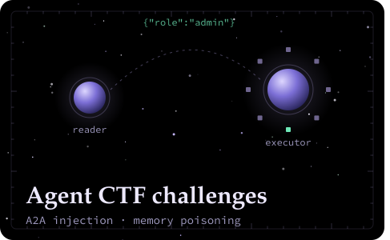
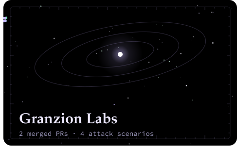
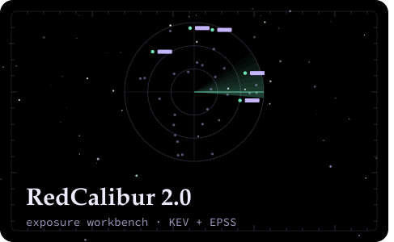
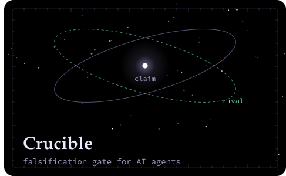
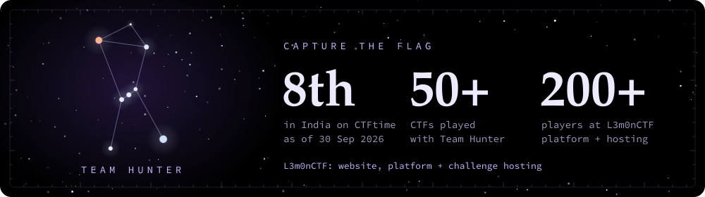

<b>More about me</b>

 

I look for the ways multi-agent LLM systems can be talked into doing things they shouldn't, then turn what I find into CTF challenges and tools so other people can practise it too.

- **Securin**, research intern in AI red teaming. Sep 2025 to May 2026.
- **Joy IT Solutions**, AI developer intern on an Azure recruitment-agent platform. Apr to Jun 2026.
- **PJPT**, Practical Junior Penetration Tester, TCM Security. 2026.
- **Amrita Vishwa Vidyapeetham**, B.Tech CSE (Cybersecurity). 2023 to 2027.

Python, Go, Rust, TypeScript · Burp Suite, Ghidra, BloodHound, nmap · Docker, Google Cloud, Azure

[praneeshrv.me](https://praneeshrv.me) · [fly through my portfolio](https://praneeshrv.github.io/nabhasa/) · [LinkedIn](https://www.linkedin.com/in/praneesh-r-v-3a81b221a/) · [praneeshrv404@gmail.com](mailto:praneeshrv404@gmail.com)
